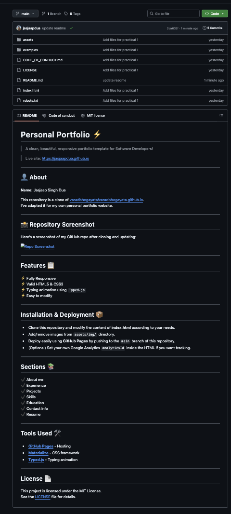
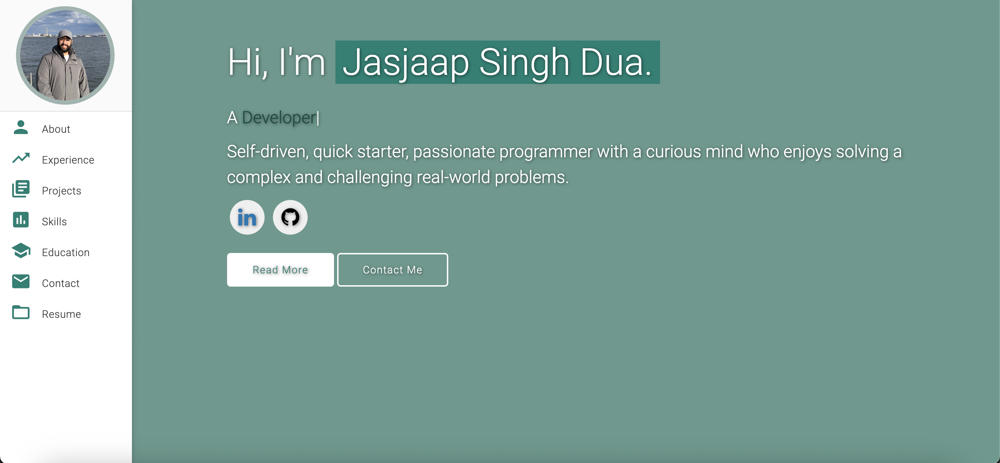
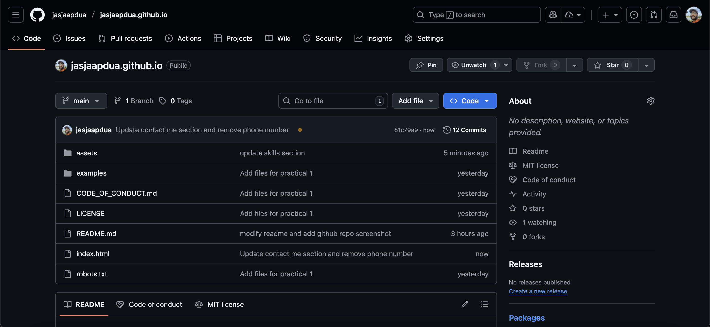
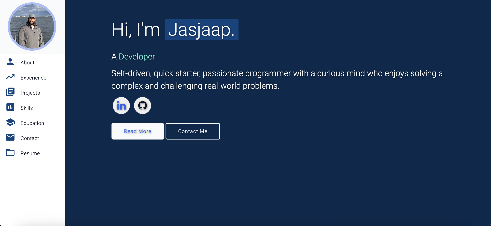
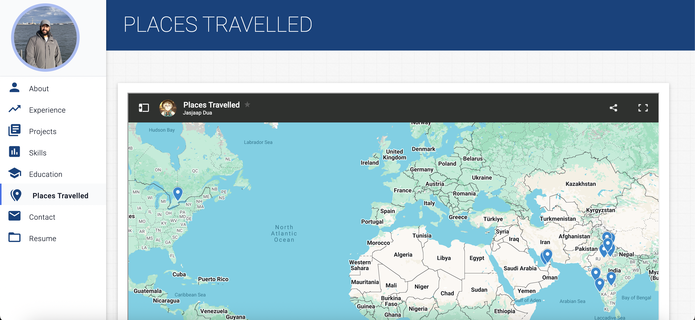
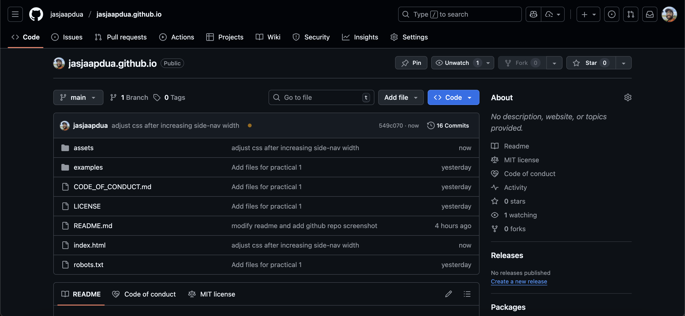
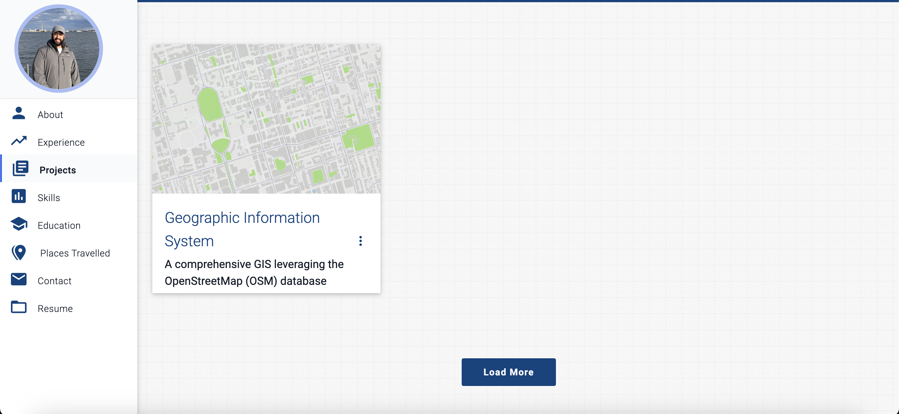
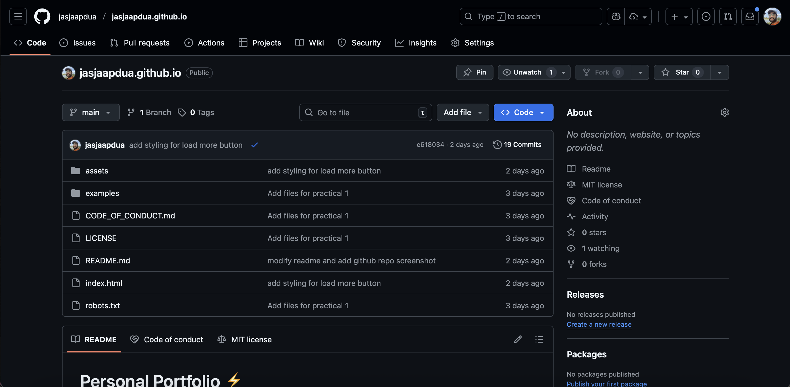

# Personal Portfolio ⚡️  
> A clean, beautiful, responsive portfolio template for Software Developers!  

> Live site: https://jasjaapdua.github.io  

---

## 👤 About
**Name:** Jasjaap Singh Dua

This repository is a clone of [varadbhogayata/varadbhogayata.github.io](https://github.com/varadbhogayata/varadbhogayata.github.io).  
I’ve adapted it for my own personal portfolio website.

---

## Features 📋
⚡️ Fully Responsive  
⚡️ Valid HTML5 & CSS3  
⚡️ Typing animation using `Typed.js`  
⚡️ Easy to modify  

---

## Installation & Deployment 📦
- Clone this repository and modify the content of **index.html** according to your needs.
- Add/remove images from `assets/img/` directory.
- Deploy easily using **GitHub Pages** by pushing to the `main` branch of this repository.
- (Optional) Set your own Google Analytics `analyticsId` inside the HTML if you want tracking.

---

## Sections 📚
✔️ About me  
✔️ Experience  
✔️ Projects  
✔️ Skills  
✔️ Education  
✔️ Contact Info  
✔️ Resume  

---

## Tools Used 🛠️
* [**GitHub Pages**](https://pages.github.com/) - Hosting  
* [**Materialize**](https://materializecss.com/) - CSS framework  
* [**Typed.js**](https://mattboldt.com/demos/typed-js/) - Typing animation  

---

## License 📄
This project is licensed under the MIT License.  
See the [LICENSE](./LICENSE) file for details.  

## Activities

### Activity 1

### Activity 2

### Activity 3

### Activity 4

### Activity 5

